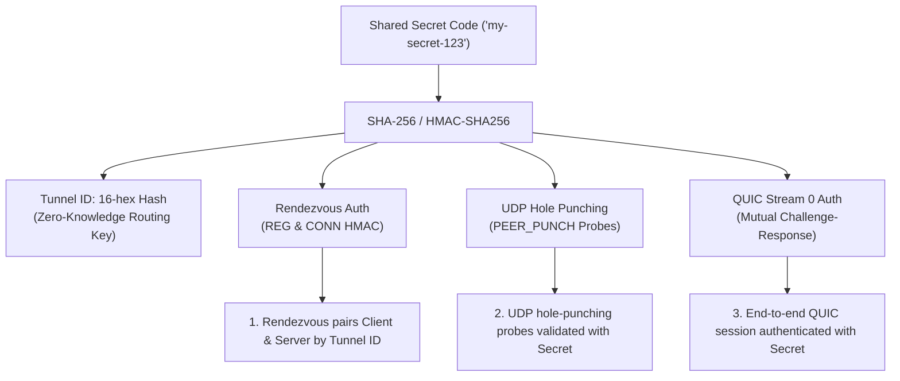

# QUIC-TCP

A high-performance Rust TCP proxy that transparently bridges connections via encrypted QUIC (over UDP), featuring Direct Mode and authenticated P2P UDP Hole Punching Mode with automatic connection restoration, peer inactivity timeouts, and a simplified single-secret security model.

---

## Features

### 1. Protocol Tunneling (QUIC <-> TCP)
Serves as a transparent proxy bridge, forwarding TCP stream data over single or multiple encrypted QUIC tunnels.

### 2. High-Throughput & Non-Blocking Asynchronous I/O
Engineered for multi-hundred Mbps line rates using Rust's non-blocking `mio` library:
- **128 KB Chunk Buffers**: Expanded ingress/egress buffers with 2 MB batch read limits per event tick, eliminating over 98% of syscall and context-switching overhead.
- **Batched UDP Ingress**: Drains arriving UDP packet bursts into `quiche::Connection::recv()` before dispatching to TCP streams.
- **Immediate UDP Packet & Window Flushing**: Flushes QUIC packet queues and stream window updates (`MAX_STREAM_DATA`) immediately upon accepting or forwarding TCP data.
- **Socket Buffer Tuning & Nagle Disabled**: Configures 4 MB UDP socket buffers (`SO_RCVBUF` / `SO_SNDBUF`), 2 MB TCP buffers, and enables `TCP_NODELAY` across all active streams.
- **Optimized QUIC Flow Control**: 1 GB connection windows, 250 MB/500 MB stream flow-control windows, and BBR congestion control with software pacing delays disabled for maximum throughput.

### 3. State Management & Reliability
- **Early Data (0-RTT)**: Supports sending and receiving early data before full connection handshake completion.
- **Partial Writes**: Non-blocking buffer queues cleanly handle flow-controlled write states across both TCP and QUIC transports.
- **Periodic PING Keepalives (NAT Mapping Maintenance)**: Both `tcp-to-quic` and `quic-to-tcp` send periodic ACK-eliciting PING frames every 5 seconds over the QUIC tunnel in P2P mode to ensure bidirectional NAT state remains warm and never expires.
- **Dead Socket Detection & Automatic RESET**: If periodic PINGs go unanswered for >15 seconds (or the QUIC connection closes), `tcp-to-quic` detects the socket is no longer usable, sends an authenticated `RESET` report to `rendezvous-server`, which signals `quic-to-tcp` to cleanly reset active sessions and restart the 3-way UDP hole punching process to restore the connection seamlessly.

---

## Simplified Unified-Secret Architecture & Security

`quic-tcp` uses a **single shared secret (pairing code)** model. Users and servers only need one secret code to establish, authenticate, and secure a tunnel.



### Key Security & Operational Principles

1. **Zero-Knowledge Rendezvous Routing**:
   - The server and client derive a 16-character hex `Tunnel ID` from their shared secret (`derive_tunnel_id`).
   - The Rendezvous server pairs clients and servers based on this `Tunnel ID` and validates signatures.
   - Unauthorized parties cannot probe or connect to tunnels without presenting valid HMAC signatures generated from the secret code.

2. **Peer Inactivity Timeout & OFFLINE Tracking**:
   - `rendezvous-server` tracks `last_seen` timestamps for all registered server tunnels.
   - If a peer server is silent for longer than `peer_timeout` (default 30 seconds, configurable via `RENDEZVOUS_PEER_TIMEOUT_SECS`), its status transitions to **`OFFLINE`** and any connected client is automatically marked disconnected.
   - Attempts to connect to an `OFFLINE` server return `ERR Server for tunnel <id> is currently OFFLINE and unresponsive`.
   - When the server sends a keepalive again, it automatically recovers back **`ONLINE`**.
   - Completely inactive tunnels are pruned after `stale_cleanup_timeout` (default 120 seconds, configurable via `RENDEZVOUS_CLEANUP_TIMEOUT_SECS`).

3. **End-to-End Mutual Authentication**:
   - In **both Direct Mode and P2P Mode**, `quic-to-tcp` and `tcp-to-quic` mutually authenticate each other over reserved **Stream 0**.
   - Upon connection establishment, `tcp-to-quic` sends an authenticated `AUTH <seq> <hmac>` challenge on stream 0. `quic-to-tcp` validates the HMAC and replay sequence, replying with `AUTH_OK <seq> <hmac>`. Unauthenticated sessions or invalid codes are terminated immediately.
   - Proxy TCP data streams start at stream ID 4 (`current_stream_id = 4`).

4. **Replay Attack Filter**:
   - Every authenticated control packet, hole punching probe, and stream 0 handshake frame includes a timestamp-derived sequence number (`seq`).
   - Receivers (`rendezvous-server`, `quic-to-tcp`, and `tcp-to-quic`) enforce a 120-second sliding time window and track seen sequences in a memory-bounded `ReplayFilter` to eliminate replay attacks.

5. **Exclusive `BUSY` Server Protection**:
   - Once a server accepts a client connection, its status transitions to **`BUSY`**.
   - Subsequent connection requests from other clients for that tunnel are rejected while the server is active.
   - When the client connection closes, the server automatically transitions back to **`IDLE`**.

6. **Multi-Round Hole Punching with Retries & Progress Logs**:
   - **Multi-Round Probing**: Hole punching executes up to 3 rounds of probes (20 probes per round at 50ms intervals) with signed HMAC probes (`PEER_PUNCH`, `PEER_PUNCH_ACK`, `PEER_PUNCH_ACK_ACK`).
   - **NAT Reflexive Endpoint Discovery**: Dynamically updates destination ports when symmetric NAT port-translation is detected.
   - **Handshake & Reconnect Retries**: `tcp-to-quic` retries the overall rendezvous handshake up to 3 times before giving up.

7. **Rendezvous Server Decoupling & Fault Tolerance**:
   - The Rendezvous Server is solely a signaling mediator. Once UDP hole punching succeeds, all TCP traffic, QUIC session encryption, stream multiplexing, and 5-second NAT keepalives travel **directly peer-to-peer**.
   - If the Rendezvous Server crashes or goes offline after connection setup, active tunnels and newly opened TCP streams over the tunnel continue functioning without interruption.

---

## Build Instructions

### Build Prerequisites

#### Linux (Debian/Ubuntu/gLinux)
Requires `cmake`:
```bash
sudo apt update && sudo apt install -y cmake
```

#### macOS
Requires Xcode Command Line Tools and `cmake` (via Homebrew):
```bash
xcode-select --install
brew install cmake
```

#### Windows
Requires Visual Studio Desktop development with C++, `cmake`, and `go` (required by BoringSSL build scripts).

### Compile
Once prerequisites are installed, build release binaries using cargo:
```bash
cargo build --release
```

---

## Linux Installation & Systemd Services

An interactive installer script (`install.sh`) is provided to install binaries to `/usr/local/bin`, generate TLS certificates, and configure auto-starting systemd services with support for **multiple concurrent instances on different ports**.

### 1. Run Interactive Installer
```bash
./install.sh
```
*(Builds locally as your standard user and only requests `sudo` when writing to system directories).*

The script will prompt you:
1. Which service to configure (`rendezvous-server`, `quic-to-tcp`, or `tcp-to-quic`).
2. Operating Mode (`P2P` or `Direct`).
3. Parameters (Rendezvous IP, Local/Remote TCP ports, and Secret Passcode).
4. **Instance Identifier** (Defaults to the port number, e.g. `quic-to-tcp@8080.service`, `tcp-to-quic@7070.service`, or `rendezvous-server@5050.service`).

You can run `./install.sh` multiple times to spawn separate tunnels for multiple local/remote ports!

### 2. List Configured & Running Services
To inspect all active/configured QUIC-TCP service instances and their listening/forwarding parameters:
```bash
./install.sh list
# or
./uninstall.sh list
```

### 3. Service Management
```bash
# Check instance status
sudo systemctl status quic-to-tcp@8080
sudo systemctl status tcp-to-quic@7070
sudo systemctl status rendezvous-server@5050

# View live system logs
sudo journalctl -u quic-to-tcp@8080 -f
sudo journalctl -u tcp-to-quic@7070 -f
sudo journalctl -u rendezvous-server@5050 -f

# Restart or stop an instance
sudo systemctl restart quic-to-tcp@8080
sudo systemctl stop quic-to-tcp@8080
```

### 4. Uninstallation & Instance Removal
```bash
./uninstall.sh
```
Provides an interactive menu to:
- **Remove a specific service instance** (keeps all other tunnels running)
- **Stop and remove all service instances**
- **Complete uninstallation** (removes services, configurations, and installed binaries)

---

## Usage Guide

### Mode 1: Direct Mode (Static Remote Endpoint)

Use Direct Mode when `quic-to-tcp` has a publicly accessible IP address or configured port forwarding.

#### 1. Start Server Proxy (`quic-to-tcp`)
Listens on UDP for QUIC connections and proxies streams to a local TCP target server:
```bash
RUST_LOG=info cargo run --release --bin quic-to-tcp <Local_UDP_IP:Port> <Remote_TCP_IP:Port> [Secret_Code]

# Example: listen on UDP port 4433, forward to local TCP port 8080 with code 'my_secret_123':
RUST_LOG=info cargo run --release --bin quic-to-tcp 127.0.0.1:4433 127.0.0.1:8080 my_secret_123
```

#### 2. Start Client Proxy (`tcp-to-quic`)
Listens on a local TCP port, connects to remote UDP server, authenticates over stream 0, and bridges TCP connections:
```bash
RUST_LOG=info cargo run --release --bin tcp-to-quic <Local_TCP_IP:Port> <Remote_UDP_IP:Port> [Secret_Code]

# Example: listen on local TCP port 7070, bridge to 127.0.0.1:4433 with code 'my_secret_123':
RUST_LOG=info cargo run --release --bin tcp-to-quic 127.0.0.1:7070 127.0.0.1:4433 my_secret_123
```

---

### Mode 2: P2P Mode (Authenticated UDP Hole Punching)

Use P2P Mode when peers are behind NATs or firewalls. Only **3 parameters** are required!

#### 1. Start the Rendezvous Server
Run on a public server endpoint (or locally for testing):
```bash
RUST_LOG=info cargo run --release --bin rendezvous-server [port]

# Example (listening on port 5050):
RUST_LOG=info cargo run --release --bin rendezvous-server 5050
```

Environment variables (optional):
- `RENDEZVOUS_PEER_TIMEOUT_SECS`: Inactivity timeout before marking tunnel `OFFLINE` (default: `30`).
- `RENDEZVOUS_CLEANUP_TIMEOUT_SECS`: Inactivity timeout before purging stale records (default: `120`).

#### 2. Start the Server Proxy (`quic-to-tcp`) in P2P Mode
Registers at `rendezvous-server` using `[Secret_Code]` and forwards incoming connections to the target TCP server:
```bash
RUST_LOG=info cargo run --release --bin quic-to-tcp p2p <Rendezvous_Server_IP:Port> <Remote_TCP_IP:Port> [Secret_Code]

# Example: forward to local TCP port 8080 through rendezvous 1.2.3.4:5050 using code 'my_tunnel_pass':
RUST_LOG=info cargo run --release --bin quic-to-tcp p2p 1.2.3.4:5050 127.0.0.1:8080 my_tunnel_pass
```

When registered, the server displays a ready-to-run client command:
```
======================================================================
[+] Tunnel ID:       7a3f89b1c2e4d567
[+] Forwarding To:   127.0.0.1:8080
[+] Rendezvous:      1.2.3.4:5050
[+] Secret Code:     my_tunnel_pass
[+] Connect with:    tcp-to-quic p2p 1.2.3.4:5050 127.0.0.1:8080 my_tunnel_pass
======================================================================
```

#### 3. Start the Client Proxy (`tcp-to-quic`) in P2P Mode
Listens on local TCP port, connects to rendezvous server with `[Secret_Code]`, performs UDP hole punching, and starts proxying:
```bash
RUST_LOG=info cargo run --release --bin tcp-to-quic p2p <Rendezvous_Server_IP:Port> <Local_TCP_IP:Port> [Secret_Code]

# Example: listen on local TCP port 7070 and connect to the tunnel using code 'my_tunnel_pass':
RUST_LOG=info cargo run --release --bin tcp-to-quic p2p 1.2.3.4:5050 127.0.0.1:7070 my_tunnel_pass
```

---

## Performance & Benchmarks

Run the built-in throughput benchmark suite:
```bash
python3 test_throughput.py
```

Typical performance on local/LAN benchmarks:
- **Direct Mode**: **~65 MB/s (~540 Mbps)** bidirectional payload throughput.
- **P2P Mode**: **~60-65 MB/s (~500-540 Mbps)** bidirectional payload throughput.

---

## Certificate Generation

The server proxy (`quic-to-tcp`) requires a TLS certificate and private key (`cert.crt` and `cert.key`) in its working directory.

Generate a self-signed certificate for development/testing:
```bash
openssl req -x509 -newkey rsa:2048 -keyout cert.key -out cert.crt -days 365 -nodes -subj "/CN=localhost"
```

---

## Project Structure

- [`src/lib.rs`](src/lib.rs): Core module re-exports and constants (`MAX_DATAGRAM_SIZE = 1450`).
- [`src/auth.rs`](src/auth.rs): `derive_tunnel_id`, HMAC-SHA256 signing/verification, atomic timestamp sequence generation, and memory-bounded `ReplayFilter`.
- [`src/protocol.rs`](src/protocol.rs): Control message definitions (`ServerReg`, `RegOk`, `ServerStatusMsg`, `ClientConn`, `ClientReset`, `PunchSignal`, `PeerProbe`).
- [`src/p2p.rs`](src/p2p.rs): P2P handshake orchestration, 3-way UDP hole punching, keepalive signaling, and automatic reconnection handling.
- [`src/session.rs`](src/session.rs): QUIC session state management, Stream 0 mutual authentication, non-blocking stream multiplexing, 128 KB batch read buffers, and partial write buffers.
- [`src/utils.rs`](src/utils.rs): Non-blocking helper routines, socket buffer tuning (`SO_RCVBUF`/`SO_SNDBUF`), `TCP_NODELAY` configuration, and stream ID allocation (streams >= 4).
- [`src/bin/tcp_to_quic.rs`](src/bin/tcp_to_quic.rs): Client proxy binary supporting Direct and P2P modes with Stream 0 auth and reachability monitoring.
- [`src/bin/quic_to_tcp.rs`](src/bin/quic_to_tcp.rs): Server proxy binary supporting Direct and P2P modes with Stream 0 verification, keepalives, and status tracking.
- [`src/bin/rendezvous_server.rs`](src/bin/rendezvous_server.rs): Central coordination server for authenticated UDP hole punching, zero-knowledge tunnel matching, peer inactivity timeouts, and replay prevention.