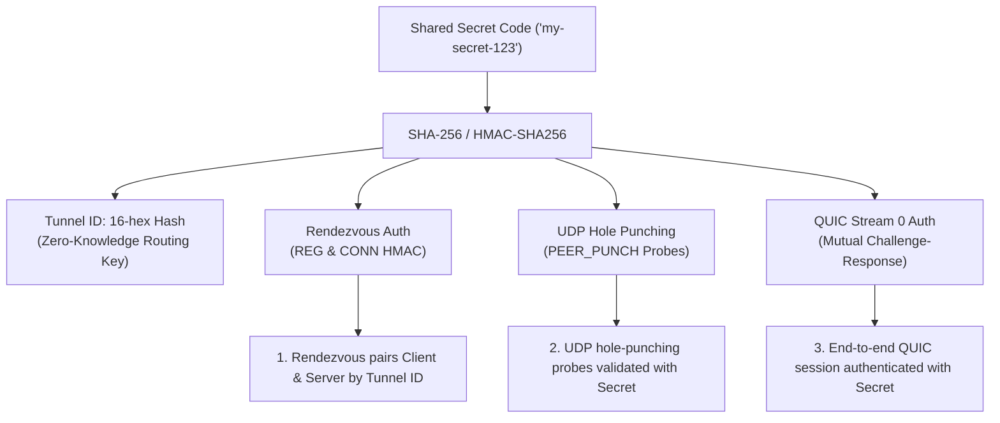

# QUIC-TCP

A high-performance Rust TCP proxy that transparently bridges connections via encrypted QUIC (over UDP), featuring Direct Mode and authenticated P2P UDP Hole Punching Mode with automatic connection restoration, peer inactivity timeouts, and a simplified single-secret security model.

---

## Features

### 1. Protocol Tunneling (QUIC <-> TCP)
Serves as a transparent proxy bridge, forwarding TCP stream data over single or multiple encrypted QUIC tunnels.

### 2. High-Throughput & Non-Blocking Asynchronous I/O
Engineered for multi-hundred Mbps line rates using Rust's non-blocking `mio` library:
- **128 KB Chunk Buffers**: Expanded ingress/egress buffers with 2 MB batch read limits per event tick, eliminating over 98% of syscall and context-switching overhead.
- **Batched UDP Ingress**: Drains arriving UDP packet bursts into `quiche::Connection::recv()` before dispatching to TCP streams.
- **Immediate UDP Packet & Window Flushing**: Flushes QUIC packet queues and stream window updates (`MAX_STREAM_DATA`) immediately upon accepting or forwarding TCP data.
- **Socket Buffer Tuning & Nagle Disabled**: Configures 4 MB UDP socket buffers (`SO_RCVBUF` / `SO_SNDBUF`), 2 MB TCP buffers, and enables `TCP_NODELAY` across all active streams.
- **Optimized QUIC Flow Control**: 1 GB connection windows, 250 MB/500 MB stream flow-control windows, and BBR congestion control with software pacing delays disabled for maximum throughput.

### 3. State Management & Reliability
- **Early Data (0-RTT)**: Supports sending and receiving early data before full connection handshake completion.
- **Partial Writes & Stream Limit Queuing**: Non-blocking buffer queues cleanly handle flow-controlled write states across both TCP and QUIC transports, and automatically queue pending TCP streams when the QUIC peer stream concurrency limit (`Error::StreamLimit`) is temporarily reached.
- **Bidirectional Stream Closure Propagation**: When a client TCP socket disconnects or encounters an error, `tcp-to-quic` sends a QUIC `FIN` and `STOP_SENDING` (`stream_shutdown`) so `quic-to-tcp` immediately closes the corresponding backend TCP socket without leaking half-open descriptors.
- **Graceful Client Exit & Server Release**: When `tcp-to-quic` exits (`SIGINT` / `SIGTERM`), it sends a QUIC `CONNECTION_CLOSE` along with an authenticated `PEER_RELEASE` packet (acknowledged by `PEER_RELEASE_ACK`) directly to `quic-to-tcp`, which immediately cleans up active sessions and notifies `rendezvous-server` (`STATUS <tunnel_id> IDLE`) so new clients can connect without waiting for timeouts.
- **Periodic PING Keepalives (NAT Mapping Maintenance)**: Both `tcp-to-quic` and `quic-to-tcp` send periodic ACK-eliciting PING frames every 5 seconds over the QUIC tunnel in P2P mode to ensure bidirectional NAT state remains warm and never expires.
- **Dead Socket Detection & Automatic RESET**: If periodic PINGs go unanswered for >15 seconds (or the QUIC connection closes), `tcp-to-quic` detects the socket is no longer usable, sends an authenticated `RESET` report to `rendezvous-server`, which signals `quic-to-tcp` to cleanly reset active sessions and restart the 3-way UDP hole punching process to restore the connection seamlessly.

---

## Simplified Unified-Secret Architecture & Security

`quic-tcp` uses a **single shared secret (pairing code)** model. Users and servers only need one secret code to establish, authenticate, and secure a tunnel.



### Key Security & Operational Principles

1. **Zero-Knowledge Rendezvous Routing**:
   - The server and client derive a 16-character hex `Tunnel ID` from their shared secret (`derive_tunnel_id`).
   - The Rendezvous server pairs clients and servers based on this `Tunnel ID` and validates signatures using constant-time HMAC verification (`ring::hmac::verify`).
   - Unauthorized parties cannot probe or connect to tunnels without presenting valid HMAC signatures generated from the secret code.

2. **Peer Inactivity Timeout & OFFLINE Tracking**:
   - `rendezvous-server` tracks `last_seen` timestamps for all registered server tunnels.
   - If a peer server is silent for longer than `peer_timeout` (default 30 seconds, configurable via `RENDEZVOUS_PEER_TIMEOUT_SECS`), its status transitions to **`OFFLINE`** and any connected client is automatically marked disconnected.
   - Attempts to connect to an `OFFLINE` server return `ERR Server for tunnel <id> is currently OFFLINE and unresponsive`.
   - When the server sends a keepalive again, it automatically recovers back **`ONLINE`**.
   - Completely inactive tunnels are pruned after `stale_cleanup_timeout` (default 120 seconds, configurable via `RENDEZVOUS_CLEANUP_TIMEOUT_SECS`).

3. **End-to-End Mutual Authentication & Authenticated Retry Tokens**:
   - In **both Direct Mode and P2P Mode**, `quic-to-tcp` and `tcp-to-quic` mutually authenticate each other over reserved **Stream 0**.
   - Upon connection establishment, `tcp-to-quic` sends an authenticated `AUTH <seq> <hmac>` challenge on stream 0. `quic-to-tcp` validates the HMAC and replay sequence, replying with `AUTH_OK <seq> <hmac>`. Unauthenticated sessions or invalid codes are terminated immediately.
   - In Direct Mode, `quic-to-tcp` mints and validates QUIC Retry address-validation tokens signed with a per-process 256-bit `HMAC_SHA256` key to prevent IP spoofing and token forgery.
   - Proxy TCP data streams start at stream ID 4 (`current_stream_id = 4`).

4. **Replay Attack Filter**:
   - Every authenticated control packet, hole punching probe, peer release signal, and stream 0 handshake frame includes a strictly monotonic timestamp-derived sequence number (`seq`).
   - Receivers (`rendezvous-server`, `quic-to-tcp`, and `tcp-to-quic`) enforce a 120-second sliding time window and track seen sequences in a memory-bounded `ReplayFilter` to eliminate replay attacks.

5. **Exclusive `BUSY` Server Protection**:
   - Once a server accepts a client connection, its status transitions to **`BUSY`**.
   - Subsequent connection requests from other clients for that tunnel are rejected while the server is active.
   - When the client connection closes or exits cleanly (`PEER_RELEASE`), the server automatically transitions back to **`IDLE`**.

6. **Multi-Round Hole Punching with Retries & Progress Logs**:
   - **Multi-Round Probing**: Hole punching executes up to 3 rounds of probes (20 probes per round at 50ms intervals) with signed HMAC probes (`PEER_PUNCH`, `PEER_PUNCH_ACK`, `PEER_PUNCH_ACK_ACK`).
   - **NAT Reflexive Endpoint Discovery**: Dynamically updates destination ports when symmetric NAT port-translation is detected.
   - **Handshake & Reconnect Retries**: `tcp-to-quic` retries the overall rendezvous handshake up to 3 times before giving up.

7. **Rendezvous Server Decoupling & Fault Tolerance**:
   - The Rendezvous Server is solely a signaling mediator. Once UDP hole punching succeeds, all TCP traffic, QUIC session encryption, stream multiplexing, and 5-second NAT keepalives travel **directly peer-to-peer**.
   - If the Rendezvous Server crashes or goes offline after connection setup, active tunnels and newly opened TCP streams over the tunnel continue functioning without interruption.

---

## Multi-Server & Multi-Client Architecture

The [`rendezvous-server`](src/bin/rendezvous_server.rs) acts as an out-of-band, stateless signaling registry for coordinating P2P NAT traversal. It does not relay proxy payload traffic; instead, it coordinates UDP hole punching so peers can establish direct peer-to-peer QUIC connections.

### 1. In-Memory Registry & Tunnel Identification

The Rendezvous Server maintains an in-memory hash map of all active server registrations:

```rust
struct RendezvousServer {
    socket: UdpSocket,
    servers: HashMap<String, ServerRecord>, // Key: 16-char hex tunnel_id
    replay_filter: ReplayFilter,
    peer_timeout: Duration,          // default 30s (RENDEZVOUS_PEER_TIMEOUT_SECS)
    stale_cleanup_timeout: Duration, // default 120s (RENDEZVOUS_CLEANUP_TIMEOUT_SECS)
}
```

- **Deterministic `tunnel_id`**: Derived via `SHA256(tunnel_code)[..8]`. Clients and servers only need to know the shared secret (`tunnel_code`) without needing to exchange dynamic IDs beforehand.
- **`ServerRecord`**: Tracks the server's public NAT endpoint (`public_addr`), target TCP port, lifecycle status (`IDLE`, `BUSY`, or `OFFLINE`), secret code, currently connected client endpoint, and `last_seen` timestamp.

---

### 2. How Multiple Servers Are Supported

Multiple backend servers ([`quic-to-tcp`](src/bin/quic_to_tcp.rs)) can register simultaneously with the same `rendezvous-server`:

1. **Isolation by Secret Code**:
   - Each server instance runs with its own secret code:
     ```bash
     # Server A (SSH forwarding)
     quic-to-tcp p2p <Rendezvous_IP:Port> 127.0.0.1:22 "tunnel-ssh-secret"

     # Server B (Web forwarding)
     quic-to-tcp p2p <Rendezvous_IP:Port> 127.0.0.1:8080 "tunnel-web-secret"
     ```
   - Each secret derives a unique `tunnel_id`, allowing any number of servers to co-exist in the registry table.
2. **Registration & Conflict Prevention**:
   - Each server sends authenticated `REG <tunnel_id> <tcp_port> <status> <tunnel_code> <seq> <hmac>` messages.
   - If an existing server re-registers with the same secret, its public endpoint and heartbeat timestamp are updated seamlessly.
   - If a peer attempts to register an existing `tunnel_id` with a different secret, the rendezvous server rejects it (`ERR Server registration rejected: tunnel ID already registered with different secret`) to prevent tunnel hijacking.
3. **Liveness & Automated Garbage Collection**:
   - Servers send heartbeats (`STATUS` or `REG`) every 10 seconds.
   - If a server stops responding for >30s (`peer_timeout`), it is marked `OFFLINE`.
   - If inactive for >120s (`stale_cleanup_timeout`), its record is purged from memory.

---

### 3. How Multiple Clients Are Supported

#### A. Multiple Clients to Different Tunnels (Fully Concurrent)
- Multiple clients connecting to different services can request connections simultaneously:
  ```bash
  # Client 1 connects to SSH tunnel
  tcp-to-quic p2p <Rendezvous_IP:Port> 127.0.0.1:2222 "tunnel-ssh-secret"

  # Client 2 connects to Web tunnel
  tcp-to-quic p2p <Rendezvous_IP:Port> 127.0.0.1:8080 "tunnel-web-secret"
  ```
- The rendezvous server matches each client by `tunnel_id`, validates the HMAC, and dispatches paired `PUNCH` signals to the corresponding server and client independently.

#### B. Multiple Clients to the Same Tunnel (1:1 Active P2P Session Rule)
- When a client connects to a tunnel, the rendezvous server marks that tunnel as **`BUSY`**:
  ```rust
  target_record.status = "BUSY".to_string();
  target_record.connected_client = Some(src);
  ```
- If a second client attempts to issue `CONN` to the **same** `tunnel_id` while it is `BUSY`, the rendezvous server explicitly rejects it:
  ```
  ERR Tunnel <id> is currently BUSY and already connected to another client
  ```
- When the active client disconnects or the session is reset, the server reports back `STATUS <tunnel_id> IDLE`, freeing the tunnel for subsequent clients.

---

### 4. Multiplexing Multiple TCP Connections over One Tunnel

Although each tunnel pairs with **one active `tcp-to-quic` client process at a time**, that single client supports **unlimited concurrent TCP application connections**:

```
[Local App 1] ──\
[Local App 2] ─── TCP ──> [tcp-to-quic] === single QUIC tunnel ===> [quic-to-tcp] ── TCP ──> [Target Daemon]
[Local App 3] ──/           (Client)       (Streams 4, 8, 12...)       (Server)
```

- **QUIC Stream Multiplexing**: Every time a local application connects to `tcp-to-quic`'s local TCP port, an independent QUIC stream ID (4, 8, 12, ...) is opened over the established peer-to-peer UDP connection.
- All streams share the single direct QUIC connection without incurring additional rendezvous handshakes or NAT traversal overhead.

---

### 5. Summary Matrix

| Scenario | Supported? | Mechanism / Behavior |
| :--- | :---: | :--- |
| **Multiple servers on 1 Rendezvous** | **Yes** | Each server uses a different secret code / `tunnel_id`. Keyed in `HashMap<String, ServerRecord>`. |
| **Multiple clients to different servers** | **Yes** | Fully concurrent. Rendezvous coordinates hole punching for each pair independently. |
| **Multiple clients to the same server** | **Sequential only** | A tunnel becomes `BUSY` when connected. Additional clients are rejected until the tunnel returns to `IDLE`. |
| **Multiple TCP sockets over 1 client tunnel** | **Yes** | Multiplexed into independent QUIC streams (streams 4, 8, 12...) over the active P2P link. |
| **IPv4 & IPv6 coexistence** | **Yes** | Multiple IPv4 and IPv6 servers can register, but client and server of a given tunnel must share the same IP family. |

---

## Build Instructions

### Build Prerequisites

#### Linux (Debian/Ubuntu/gLinux)
Requires `cmake`, `clang`, and `libclang-dev` (used by `bindgen` for BoringSSL FFI bindings):
```bash
sudo apt update && sudo apt install -y cmake clang libclang-dev build-essential
```

#### Linux (Fedora / RHEL / Rocky)
```bash
sudo dnf install -y cmake clang clang-devel gcc-c++
```

#### Linux (Arch Linux)
```bash
sudo pacman -S cmake clang base-devel
```

#### macOS
Requires Xcode Command Line Tools and `cmake` (via Homebrew):
```bash
xcode-select --install
brew install cmake
```

#### Windows
Requires Visual Studio Desktop development with C++, `cmake`, and `go` (required by BoringSSL build scripts).

### Compile
Once prerequisites are installed, build release binaries using cargo:
```bash
cargo build --release
```

---

## Linux Installation & Systemd Services

An interactive installer script (`install.sh`) is provided to install binaries to `/usr/local/bin`, generate TLS certificates, and configure auto-starting systemd services with support for **multiple concurrent instances on different ports**.

### 1. Run Interactive Installer
```bash
./install.sh
```
*(Builds locally as your standard user and only requests `sudo` when writing to system directories).*

The script will prompt you:
1. Which service to configure (`rendezvous-server`, `quic-to-tcp`, or `tcp-to-quic`).
2. Operating Mode (`P2P` or `Direct`).
3. Parameters (Rendezvous IP, Local/Remote TCP ports, and Secret Passcode).
4. **Instance Identifier** (Defaults to the port number, e.g. `quic-to-tcp@8080.service`, `tcp-to-quic@7070.service`, or `rendezvous-server@5050.service`).

You can run `./install.sh` multiple times to spawn separate tunnels for multiple local/remote ports!

### 2. List Configured & Running Services
To inspect all active/configured QUIC-TCP service instances and their listening/forwarding parameters:
```bash
./install.sh list
# or
./uninstall.sh list
```

### 3. Service Management
```bash
# Check instance status
sudo systemctl status quic-to-tcp@8080
sudo systemctl status tcp-to-quic@7070
sudo systemctl status rendezvous-server@5050

# View live system logs
sudo journalctl -u quic-to-tcp@8080 -f
sudo journalctl -u tcp-to-quic@7070 -f
sudo journalctl -u rendezvous-server@5050 -f

# Restart or stop an instance
sudo systemctl restart quic-to-tcp@8080
sudo systemctl stop quic-to-tcp@8080
```

### 4. Uninstallation & Instance Removal
```bash
./uninstall.sh
```
Provides an interactive menu to:
- **Remove a specific service instance** (keeps all other tunnels running)
- **Stop and remove all service instances**
- **Complete uninstallation** (removes services, configurations, and installed binaries)

---

## Usage Guide

### Mode 1: Direct Mode (Static Remote Endpoint)

Use Direct Mode when `quic-to-tcp` has a publicly accessible IP address or configured port forwarding. Supports both **IPv4** and **IPv6** (using standard bracket notation `[IPv6]:Port`).

#### 1. Start Server Proxy (`quic-to-tcp`)
Listens on UDP for QUIC connections and proxies streams to a local TCP target server:
```bash
RUST_LOG=info cargo run --release --bin quic-to-tcp <Local_UDP_IP:Port> <Remote_TCP_IP:Port> [Secret_Code]

# IPv4 Example: listen on UDP port 4433, forward to local TCP port 8080:
RUST_LOG=info cargo run --release --bin quic-to-tcp 127.0.0.1:4433 127.0.0.1:8080 my_secret_123

# IPv6 Example: listen on all IPv6 interfaces [::]:4433, forward to local IPv6 TCP service [::1]:8080:
RUST_LOG=info cargo run --release --bin quic-to-tcp [::]:4433 [::1]:8080 my_secret_123
```

#### 2. Start Client Proxy (`tcp-to-quic`)
Listens on a local TCP port, connects to remote UDP server, authenticates over stream 0, and bridges TCP connections:
```bash
RUST_LOG=info cargo run --release --bin tcp-to-quic <Local_TCP_IP:Port> <Remote_UDP_IP:Port> [Secret_Code]

# IPv4 Example: listen on local TCP port 7070, bridge to 127.0.0.1:4433:
RUST_LOG=info cargo run --release --bin tcp-to-quic 127.0.0.1:7070 127.0.0.1:4433 my_secret_123

# IPv6 Example: listen on local IPv6 port [::]:7070, bridge to remote IPv6 server [2001:db8::1]:4433:
RUST_LOG=info cargo run --release --bin tcp-to-quic [::]:7070 [2001:db8::1]:4433 my_secret_123
```

---

### Mode 2: P2P Mode (Authenticated UDP Hole Punching)

Use P2P Mode when peers are behind NATs or firewalls. Only **3 parameters** are required! Works seamlessly across both IPv4 and IPv6 networks.

#### 1. Start the Rendezvous Server
Run on a public server endpoint (or locally for testing):
```bash
RUST_LOG=info cargo run --release --bin rendezvous-server [port_or_bind_addr]

# IPv4 Example (listening on all IPv4 interfaces on port 5050):
RUST_LOG=info cargo run --release --bin rendezvous-server 5050

# IPv6 / Dual-Stack Example (listening on all IPv6 interfaces on port 5050):
RUST_LOG=info cargo run --release --bin rendezvous-server [::]:5050
```

Environment variables (optional):
- `RENDEZVOUS_PEER_TIMEOUT_SECS`: Inactivity timeout before marking tunnel `OFFLINE` (default: `30`).
- `RENDEZVOUS_CLEANUP_TIMEOUT_SECS`: Inactivity timeout before purging stale records (default: `120`).

#### 2. Start the Server Proxy (`quic-to-tcp`) in P2P Mode
Registers at `rendezvous-server` using `[Secret_Code]` and forwards incoming connections to the target TCP server:
```bash
RUST_LOG=info cargo run --release --bin quic-to-tcp p2p <Rendezvous_Server_IP:Port> <Remote_TCP_IP:Port> [Secret_Code]

# IPv4 Example: forward to local TCP port 8080 through rendezvous 1.2.3.4:5050 using code 'my_tunnel_pass':
RUST_LOG=info cargo run --release --bin quic-to-tcp p2p 1.2.3.4:5050 127.0.0.1:8080 my_tunnel_pass

# IPv6 Example: forward to local IPv6 port [::1]:8080 through IPv6 rendezvous [2001:db8::100]:5050:
RUST_LOG=info cargo run --release --bin quic-to-tcp p2p [2001:db8::100]:5050 [::1]:8080 my_tunnel_pass
```

When registered, the server displays a ready-to-run client command:
```
======================================================================
[+] Tunnel ID:       7a3f89b1c2e4d567
[+] Forwarding To:   127.0.0.1:8080
[+] Rendezvous:      1.2.3.4:5050
[+] Secret Code:     my_tunnel_pass
[+] Connect with:    tcp-to-quic p2p 1.2.3.4:5050 127.0.0.1:8080 my_tunnel_pass
======================================================================
```

#### 3. Start the Client Proxy (`tcp-to-quic`) in P2P Mode
Listens on local TCP port, connects to rendezvous server with `[Secret_Code]`, performs UDP hole punching, and starts proxying:
```bash
RUST_LOG=info cargo run --release --bin tcp-to-quic p2p <Rendezvous_Server_IP:Port> <Local_TCP_IP:Port> [Secret_Code]

# IPv4 Example: listen on local TCP port 7070 and connect to the tunnel:
RUST_LOG=info cargo run --release --bin tcp-to-quic p2p 1.2.3.4:5050 127.0.0.1:7070 my_tunnel_pass

# IPv6 Example: listen on local IPv6 port [::]:7070 and connect via IPv6 rendezvous:
RUST_LOG=info cargo run --release --bin tcp-to-quic p2p [2001:db8::100]:5050 [::]:7070 my_tunnel_pass
```

---

### IPv6 & Dual-Stack Support Notes

- **Bracket Notation**: All IPv6 addresses should be enclosed in brackets with their port, e.g. `[::1]:8080`, `[2001:db8::1]:4433`, or `[::]:7070`.
- **Automatic Socket Family Detection**: In P2P mode, both `quic-to-tcp` and `tcp-to-quic` inspect the Rendezvous address and automatically bind their underlying UDP socket to `[::]:0` for IPv6 or `0.0.0.0:0` for IPv4.
- **Firewall Traversal on IPv6**: Because IPv6 typically uses stateful firewalls without address translation (no CGNAT/Symmetric NAT), the 3-way UDP hole-punching protocol (`PEER_PUNCH`) opens inbound firewall pinholes with 100% reliability.
- **Path MTU & Safe Datagram Size**: QUIC uses a default `MAX_DATAGRAM_SIZE = 1200` bytes (RFC 9000 standard). This prevents packet drops on networks with reduced MTU, such as Google Cloud Platform VPC (MTU 1460), WireGuard (MTU 1420), PPPoE (MTU 1492), or minimum IPv6 MTU (1280). Can be tuned via `QUIC_MAX_DATAGRAM_SIZE` env var if on a jumbo-frame LAN.

---

## Performance & Benchmarks

Run the built-in throughput benchmark suite:
```bash
python3 test_throughput.py
python3 test_throughput_ipv6.py
```

Typical performance on local/LAN benchmarks:
- **Direct Mode**: **~65 MB/s (~540 Mbps)** bidirectional payload throughput.
- **P2P Mode**: **~60-65 MB/s (~500-540 Mbps)** bidirectional payload throughput.

---

## Certificate Generation

The server proxy (`quic-to-tcp`) requires a TLS certificate and private key (`cert.crt` and `cert.key` by default, or custom paths via `QUIC_CERT_PATH` and `QUIC_KEY_PATH` environment variables).

Generate a self-signed certificate for development/testing:
```bash
openssl req -x509 -newkey rsa:2048 -keyout cert.key -out cert.crt -days 365 -nodes -subj "/CN=localhost"
```

---

## Android Shared Libraries & Phone/Watch App

`quic-tcp` compiles into native Android shared libraries (`libquic_to_tcp.so` and `libtcp_to_quic.so`) for both 32-bit ARM (`armeabi-v7a` / `armv7-linux-androideabi`, e.g., Pixel Watch / merioth) and 64-bit ARM64 (`arm64-v8a` / `aarch64-linux-android`, e.g., Pixel phones / yogi / yoga), and includes a complete Android Phone & Wear OS Watch application under [`android/`](android/).

### 1. Build Native Libraries & Signed APKs
```bash
./build_android.sh all
```
Or build specific targets:
- `./build_android.sh merioth`: Builds 32-bit `armv7-linux-androideabi` binaries and shared libraries (`libquic_to_tcp.so`, `libtcp_to_quic.so`).
- `./build_android.sh yogi`: Builds 64-bit `aarch64-linux-android` binaries and shared libraries (`libquic_to_tcp.so`, `libtcp_to_quic.so`).
- `./build_android.sh apk`: Compiles and signs the Android Phone and Wear OS Watch APKs using the staged native libraries.

### 2. Output Artifacts
- **32-bit Android Shared Libraries (`armeabi-v7a`)**:
  - `target/armv7-linux-androideabi/release/libquic_to_tcp.so`
  - `target/armv7-linux-androideabi/release/libtcp_to_quic.so`
  - `android/app/src/main/jniLibs/armeabi-v7a/{libquic_to_tcp.so,libtcp_to_quic.so}`
- **64-bit Android Shared Libraries (`arm64-v8a`)**:
  - `target/aarch64-linux-android/release/libquic_to_tcp.so`
  - `target/aarch64-linux-android/release/libtcp_to_quic.so`
  - `android/app/src/main/jniLibs/arm64-v8a/{libquic_to_tcp.so,libtcp_to_quic.so}`
- **Signed APKs**:
  - `android/build/quic-tcp-phone.apk` (Android Phone APK)
  - `android/build/quic-tcp-watch.apk` (Wear OS Watch APK with `android.hardware.type.watch` feature)
  - `android/build/quic-tcp-universal.apk` (Universal APK compatible with both Phone and Watch)

### 3. Android App Features
- **Engine Role Selection**: Switch between `tcp-to-quic` (Client) and `quic-to-tcp` (Server), backed by [`TcpToQuicLib`](android/app/src/main/java/com/quictcp/app/TcpToQuicLib.java) (`libtcp_to_quic.so`) and [`QuicToTcpLib`](android/app/src/main/java/com/quictcp/app/QuicToTcpLib.java) (`libquic_to_tcp.so`).
- **Connection Type Selection**: Switch between **P2P (Rendezvous)** and **Direct** mode:
  - **P2P Mode**: Displays `Rendezvous_IP:Port`, Local IP (default `127.0.0.1`), Local Port (default `1088`), and Secret (`tunnel-ssh-secret`).
  - **Direct Mode**: Automatically hides `Rendezvous_IP:Port` and shows Direct QUIC UDP `IP:Port`, Local IP (`127.0.0.1`), Local Port (`1088`), and Secret (`tunnel-ssh-secret`).
- **Connect / Disconnect Button**: Starts and stops the native proxy engine cleanly (sending `PEER_RELEASE` to the server on client stop).
- **Live Log Output Area**: Streams real-time logs from the Rust `quic-to-tcp` and `tcp-to-quic` libraries via JNI (`drainLogs()`) with auto-scroll and Clear Log controls.
- **Persistent Settings**: Automatically saves and restores all user inputs via `SharedPreferences` ([`ProxyConfig`](android/app/src/main/java/com/quictcp/app/ProxyConfig.java)).
- **Background Execution**: Runs inside [`ProxyForegroundService`](android/app/src/main/java/com/quictcp/app/ProxyForegroundService.java) (`START_STICKY`) with a persistent foreground notification (including a quick **Disconnect** action button), `PARTIAL_WAKE_LOCK`, and high-performance `WifiLock` so the tunnel stays alive when the app is minimized or the screen is off.

### 4. Install via ADB
```bash
# Install on an Android Phone:
adb install -r android/build/quic-tcp-phone.apk

# Install on a Wear OS Watch:
adb install -r android/build/quic-tcp-watch.apk
```

---

## Project Structure

- [`src/lib.rs`](src/lib.rs): Core module re-exports and constants (`MAX_DATAGRAM_SIZE = 1200`, `APPLICATION_PROTO`).
- [`src/quic_to_tcp.rs`](src/quic_to_tcp.rs): Reusable `quic-to-tcp` server engine (`ServerMode`, `run_quic_to_tcp`) with embedded TLS certificate fallback for Android and CLI.
- [`src/tcp_to_quic.rs`](src/tcp_to_quic.rs): Reusable `tcp-to-quic` client engine (`ClientMode`, `run_tcp_to_quic`) for Android and CLI.
- [`src/android_jni.rs`](src/android_jni.rs): JNI exports (`QuicToTcpLib` and `TcpToQuicLib`) and thread-safe in-memory log ring buffer (`ProxyLogger`) + Android Logcat bridge.
- [`src/auth.rs`](src/auth.rs): `derive_tunnel_id`, constant-time HMAC-SHA256 signing/verification, strictly monotonic atomic sequence generation, and memory-bounded `ReplayFilter`.
- [`src/config.rs`](src/config.rs): CLI argument parsing (`ProxyCliArgs`, `ProxyMode`, `RendezvousConfig`) and QUIC transport/TLS configuration builders.
- [`src/error.rs`](src/error.rs): Unified `ProxyError` and `Result<T>` error types across all modules.
- [`src/protocol.rs`](src/protocol.rs): Control message definitions (`ServerReg`, `RegOk`, `ServerStatusMsg`, `ClientConn`, `ClientReset`, `PunchSignal`, `PeerProbe`, `PeerRelease`).
- [`src/p2p.rs`](src/p2p.rs): P2P handshake orchestration, 3-way UDP hole punching, replay-protected signaling, graceful peer release (`send_peer_release`), and automatic reconnection handling.
- [`src/session.rs`](src/session.rs): QUIC session state management, Stream 0 mutual authentication, non-blocking stream multiplexing, 128 KB batch read buffers, and partial write buffers.
- [`src/stream_map.rs`](src/stream_map.rs): Bidirectional token-to-stream mapping (`StreamMap`) for O(1) lookup and cleanup of active TCP/QUIC streams.
- [`src/token.rs`](src/token.rs): HMAC-SHA256 authenticated QUIC Retry token minting and validation (`mint_token`, `validate_token`).
- [`src/utils.rs`](src/utils.rs): Non-blocking helper routines, POSIX signal handling (`install_shutdown_handlers`, `is_shutdown_requested`, `request_shutdown`), socket buffer tuning (`SO_RCVBUF`/`SO_SNDBUF`), `TCP_NODELAY`, and stream ID allocation.
- [`src/bin/tcp_to_quic.rs`](src/bin/tcp_to_quic.rs): Client proxy binary supporting Direct and P2P modes with Stream 0 auth, stream-limit queuing, reachability monitoring, and graceful exit release.
- [`src/bin/quic_to_tcp.rs`](src/bin/quic_to_tcp.rs): Server proxy binary supporting Direct and P2P modes with multi-client sessions, Stream 0 verification, keepalives, and status tracking.
- [`src/bin/rendezvous_server.rs`](src/bin/rendezvous_server.rs): Central coordination server for authenticated UDP hole punching, zero-knowledge tunnel matching, peer inactivity timeouts, and replay prevention.
- [`android/`](android/): Android Phone and Wear OS Watch app project (`MainActivity`, `ProxyForegroundService`, `ProxyConfig`, `QuicToTcpLib`, `TcpToQuicLib`).